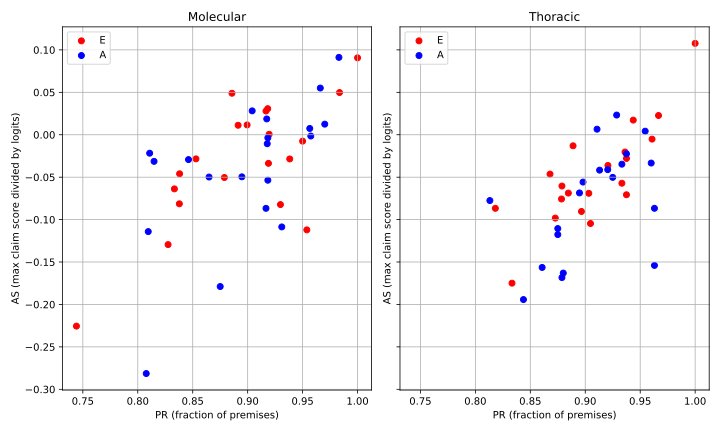
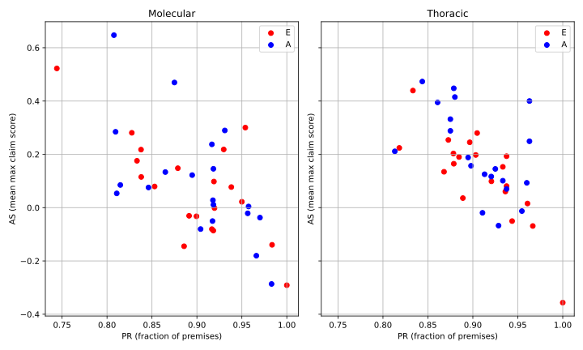
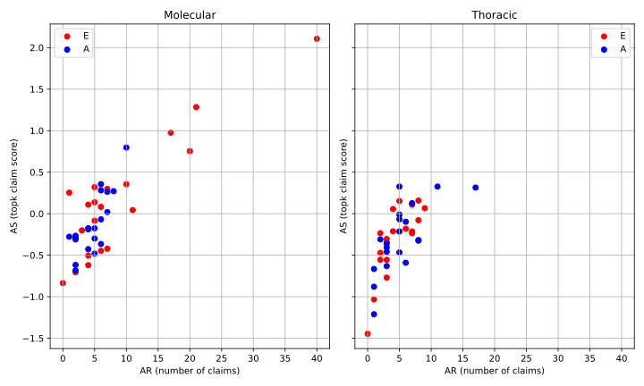
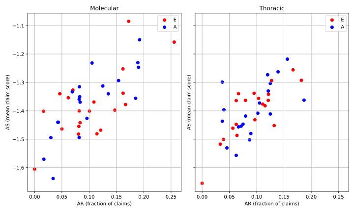
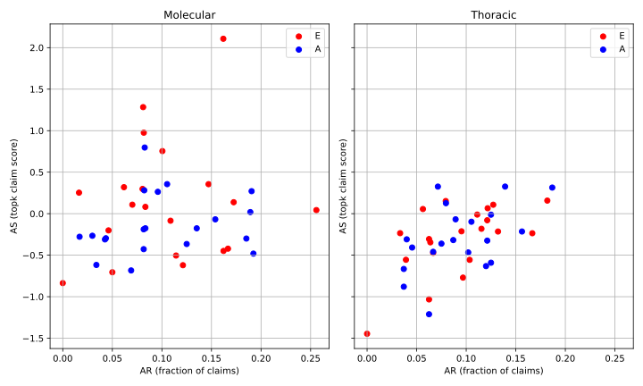

# BERT for scientific literature Argument Mining

The idea is to deploy a finetuned BERT on scientific literature in order to gain information about the argumentative content of a scientific articles from medical literature.

<details>
<summary>Code organization</summary>

```bash
pip install -r requirements.txt
```

- `data/`
  - `finetuning/` AbstRCT and SciArg datasets, and a merged version of these that will be the actual training dataset
  - `inference/` two sets of medical literature abstracts
- `inference/`
  - `results/`
  - `inference.py` inference main program on articles from medical literature
  - `load_and_eval.py` load validation dataset from training and compute validation accuracy
  - `utils.py` inference utilities
- `src/`
  - `ckps/`
  - `configs/` configuration files divided by dataset
    - Contains `generate_config.py` for automatic configuration files generation
  - `models/` model definitions
  - `results/`
  - `utils/` various utilities in `misc_utils.py` and `train_utils.py`
  - `baseline.py` baseline with base machine learning models to improve
  - `cmd_args.py` main programs arguments
    - `python src/main.py --help`
    - `python src/ftdata.py --help`
  - `ftdata.py` utilities for loading datasets
  - `main.py` main program for finetuning BERT family models
  - `train.py` training loop

```bash
python src/main.py --help
```

</details>


## :one: Finetuning BERT for argument component detection

The first phase consists in a model selection strategy in order to find the best model on the argument component detection task, that is a **sentence classification** task. We start by building the finetuning dataset, then we choose the best model based on validation accuracy.

### Dataset

Searching on HuggingFace, we found two datasets specifically for argument mining, with annotated argument components and relations. We only pick the argument components, since on inference we want to quantify the argumentative content by using the amount of claims and premises in the article, that is a collection of sentences.

We found that the two corpus partially share the argumentative model, so we've done a naive mapping from the second dataset into the first one, then naming it the `mixed` dataset. This results in a balanced dataset.

- [pie/abstrct](https://huggingface.co/datasets/pie/abstrct) these are RCT abstracts on various diseases
  - Class 0: `Premise`
  - Class 1: `Claim`
  - Class 2: `MajorClaim`
- [pie/sciarg](https://huggingface.co/datasets/pie/sciarg) this is a corpus of scientific publications
  - `background_claim` -> `Claim`
  - `own_claim` -> `MajorClaim`
  - `data` -> `Premise`

After finetuning, when doing few tests on the inference dataset, we saw that with 3 classes we have a higher expressive power than using 2 classes (merging `Claim` and `MajorClaim` sentences).

### Backbones

The idea is to pick a pretrained backbone and attaching a classifier on top using `AutoModelForSequenceClassification` provided by the `transformers` module, as backbones we choose DistilBERT and SentenceBERT.

- [distilbert](https://huggingface.co/distilbert/distilbert-base-uncased)(`distilbert-base-uncased`): 67M params
- [sbert](https://huggingface.co/sentence-transformers/all-mpnet-base-v2)(`all-mpnet-base-v2`): 109M params

```bash
python src/main.py --config src/configs/sbert_full_mixed.yaml --view
```

Few tests were launched in order to gain information about the compute cost required. We tried full-finetuned, only the head, and few LoRA configurations. Full-finetuning reaches the best performances, 

<!--
### Baseline

Before starting with finetuning we look for baseline performances. That is we use the two backbones as feature extractors, on top of their representation, we train a logistic regression classifier.

- `python src/baseline.py --dataset mixed --extractor distilbert`
- `python src/baseline.py --dataset mixed --extractor sbert`

| Extractor    | Dataset | `val_acc` |
| ------------ | ------- | --------- |
| `distilbert` | `mixed` | 0.     |
| `sbert`      | `mixed` | 0.     |
-->

### Finetuning

- `python src/main.py --config src/configs/mixed/distilbert_full_mixed.yaml`
- `python src/main.py --config src/configs/mixed/sbert_full_mixed.yaml`

| model        | setting           | val_acc |
| ------------ | ----------------- | ------- |
| `distilbert` | `full-finetuning` | 0.780   |
| `sbert`      | `full-finetuning` | 0.800   |

We ended up by choosing `sbert` as the best finetuned model.


## :two: Deploy BERT on medical literature

We deploy the finetuned BERT on two datasets containing medical literature abstracts

See results from the [report](./NLP_project.pdf) with detailed metrics definitions.

<!--
For example, do inference on cuda with metrics pair 1

```bash
python inference/inference.py --device cuda --metric_id 1
```

<p align="middle">
  
  &nbsp;
  
  &nbsp;
  
</p>

<p align="middle">
  
  &nbsp;
  
</p>
-->
